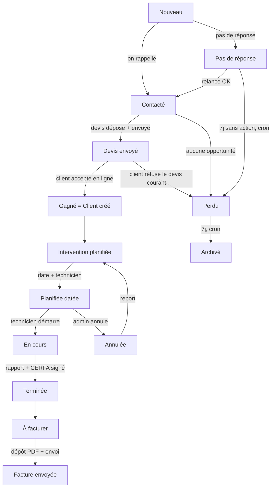
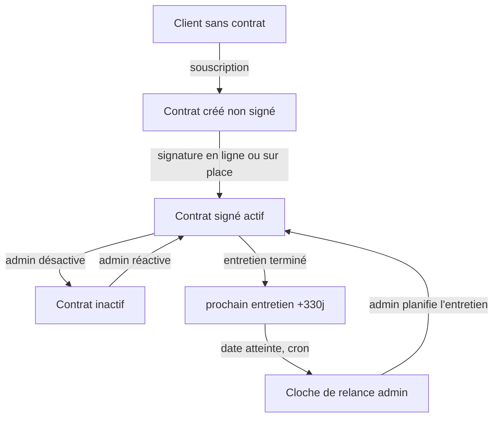

# Parcours prospect jusqu'à la facture (état des lieux)

But de ce document : décrire, étape par étape, le parcours réel d'un prospect chez ClimExpert, depuis sa création jusqu'à l'envoi de la facture, avec tous les cas de figure, ce qui est automatique, ce qui est manuel, et les trous à combler. Il sert de base de réflexion (à retravailler), il ne décrit pas un objectif mais l'existant.

État du code au 25 juin 2026. Les points marqués « (à vérifier) » sont des zones où le comportement exact reste à confirmer dans le code.

---

## 1. Vue d'ensemble : le parcours nominal

Le chemin « heureux », du premier contact à l'argent encaissé :

1. Un **prospect** entre en base (formulaire du site, import de numéros, ou saisie manuelle). Statut `nouveau`.
2. On le **rappelle**, on **qualifie** son besoin (guide d'appel). Statut `contacté`.
3. On lui **envoie un devis** (PDF déposé, e-mail avec lien de décision). Statut `devis_envoyé`.
4. Le client **accepte** en ligne. Le prospect devient **client** (`gagné`), un **chantier** et une **intervention à planifier** sont créés automatiquement.
5. On **planifie** l'intervention (date + technicien).
6. Le **technicien réalise** l'intervention, remplit le **rapport** (photos + CERFA signé). Statut `terminée`.
7. L'intervention apparaît dans **« À facturer »**. On **dépose la facture PDF** et on l'envoie au client (avec le RIB). Fin du cycle.
8. En parallèle, si un **contrat d'entretien** a été signé, une **relance** est programmée à +330 jours pour le prochain entretien.

---

## 2. Les étapes en détail

### 2.1 Prospect (lead)

**Statuts** (`leadStatusEnum`) : `nouveau`, `pas_de_reponse`, `contacté`, `devis_envoyé`, `gagné`, `perdu`.

**Entrée en base (3 canaux)** :
- Formulaire public du site (`/contact`) : crée un lead `nouveau`, envoie un e-mail interne, crée une notification, limite anti-spam (5/min/IP).
- Import en masse de numéros : 1 lead par numéro non déjà présent, source téléphone.
- Saisie manuelle dans le CRM : garde anti-doublon sur nom + téléphone (refus si déjà présent).

**Qui fait quoi** :
- Le **gérant / commercial** fait avancer le prospect manuellement (glisser-déposer dans le Kanban, ou menu de statut, ou boutons « Pas de réponse », « Contact établi »).
- La **qualification des besoins** (type de bien, prestation, budget, délai) se remplit pendant l'appel et est reportée dans la fiche client à la conversion.
- Une **prochaine action datée** sert d'anti-oubli (la carte passe en alerte rouge si la date est dépassée).
- Verrou optimiste (`version`) : si deux personnes modifient le même prospect, la seconde reçoit un conflit et doit recharger.

**Automatismes (cron quotidien)** :
- `pas_de_reponse` depuis 5 jours sans relance : notification de rappel.
- `pas_de_reponse` depuis 7 jours : passage automatique en `perdu`.
- `devis_envoyé` depuis 30 jours sans réponse : notification de rappel (mais pas de bascule auto).
- `perdu` depuis 7 jours : archivé (sort du Kanban, conservé en base).

### 2.2 Devis

Deux points d'entrée, même mécanique :
- Depuis un **prospect existant** : bouton « Envoyer un devis » sur sa fiche.
- Depuis **« Nouveau devis »** (CRM ou fiche client) : pour un client existant ou un nouveau contact (crée le prospect au passage).

**Mécanique d'un envoi** :
1. Dépôt du PDF (fait sur un logiciel tiers), montant optionnel, message optionnel.
2. Le PDF est stocké, un **lien public unique** est généré, un e-mail part au client.
3. Le prospect passe en `devis_envoyé`, le montant est mémorisé.
4. Une ligne est ajoutée à l'**historique des devis** (`devis_envois`) : un prospect peut recevoir **plusieurs devis différents**, chaque lien gardant sa propre décision.

**Décision du client** (page publique `/mon-devis/[token]`, route `/api/devis-decision`) :
- **Accepter** : le prospect passe en `gagné`, conversion en client (idempotent), création d'une **intervention à planifier**, notification au gérant (cloche + e-mail).
- **Décliner** : choix d'un motif parmi 6 options. Si c'est le **devis courant**, le prospect passe en `perdu`. Si c'est un ancien devis alors qu'un autre est encore en attente, le statut ne change pas.

**Vue de suivi** : page **Devis** (`/admin/suivi-devis`) avec « En attente » et « Finalisés » (acceptés + déclinés), et le CA signé.

### 2.3 Conversion et intervention

**Conversion** : au passage en `gagné` (manuel ou via acceptation du devis), `createClientFromLead` crée la fiche client (copie coordonnées, notes, qualification), lie le prospect au client, et crée un **chantier**. La fonction est idempotente (pas de doublon si rejoué).

**Intervention** :
- **Statuts** (`interventionStatusEnum`) : `planifiée`, `en_cours`, `terminée`, `annulée`.
- **Types** (`projectTypeEnum`) : `installation`, `entretien`, `depannage`, `contrat-pro`, `autre`.
- À l'acceptation d'un devis : intervention créée en `planifiée`, **sans date** (à planifier), durée estimée 120 min, type repris du projet du prospect.
- Création manuelle aussi possible (depuis une fiche client, le calendrier, ou le formulaire dédié).

**Déroulé** :
1. L'admin **assigne un technicien et fixe la date** (l'intervention sans date apparaît dans une liste « à planifier »).
2. Le **technicien démarre** l'intervention : `en_cours`. (Le flux exact de confirmation du créneau côté technicien ou client reste à vérifier.)
3. Le technicien **soumet le rapport** : photos obligatoires (nombre minimum selon le nombre d'unités), CERFA signé par le client au doigt, conformité, question de l'entretien annuel. L'intervention passe alors en `terminée` (impossible de forcer `terminée` à la main).
4. Si l'entretien annuel est accepté sur place, un **contrat d'entretien signé** est créé. Des suivis (J+7, J+30, J+365) sont programmés.

**Annulation / report** : l'admin peut annuler (avec motif, e-mail au client) ou reporter (l'ancienne devient `annulée`, une nouvelle intervention liée est créée).

Un client peut avoir **plusieurs interventions** (installation, puis entretiens annuels, puis dépannages), sur un ou plusieurs chantiers.

### 2.4 Facturation

La facturation est **entièrement manuelle** et se déclenche quand une intervention est `terminée`.

- Toute intervention `terminée` sans facture apparaît dans **« À facturer »** (page `/admin/facturation` + tâche du dashboard).
- L'admin **dépose le PDF** de la facture (fait sur son logiciel de compta), qui est stocké, envoyé au client par e-mail **avec le RIB**, et ajouté aux documents du client.
- L'intervention enregistre `factureUrl` et `factureEnvoyeeLe`, et sort de « À facturer ».
- **Aucune relance de paiement automatique** : le gérant relance lui-même. Le paiement se fait par virement (pas de Stripe).

Point d'attention : il existe **deux systèmes de facture en parallèle** dans le code, la facture attachée à l'intervention (`factureUrl` / `factureEnvoyeeLe`) et une **table `factures` autonome** (`/admin/factures`, statuts en_attente / payée / en_retard). Les deux ne sont pas liés. À clarifier (voir section 6).

### 2.5 Client et contrat d'entretien

**Fiche client** : regroupe coordonnées, interventions, factures, documents (CERFA, contrats), SAV. Distinction **particulier / professionnel / sous-traitance** (badge), avec pour les pros le contact (représentant) et le SIRET.

**Portail client** (`/suivi/[token]`) : accès en lecture seule par lien personnel (envoyé par e-mail), pour consulter ses interventions, factures et documents.

**Contrat d'entretien** (produit distinct du devis initial) :
- Création par l'admin ou le technicien (sur place). Numéro auto (ENT-AAAA-XXXX).
- Signature électronique (lien `/contrat/signature/[token]`) ou sur place (au doigt). À la signature : PDF final scellé, stocké, ajouté aux documents, e-mail de confirmation.
- `prochainEntretienLe` réglé à +330 jours. À chaque entretien terminé, cette date est avancée de +330 jours et la cloche de relance est réarmée.

**Tarification** (`lib/contrat-pricing.ts`, figée dans le code) :
- Particulier : 200 EUR TTC avec contrat, 250 EUR TTC sans (TVA 10 %).
- Professionnel : 182 EUR HT avec contrat, 228 EUR HT sans (TVA 20 %), plus 55 EUR par unité supplémentaire.

---

## 3. Les automatismes (récap)

| Déclencheur | Effet | Type |
|---|---|---|
| Formulaire public rempli | Lead `nouveau` + e-mail interne + notification | auto |
| Passage en `gagné` | Création client + chantier (idempotent) | auto |
| Acceptation d'un devis | `gagné` + client + intervention à planifier + notif | auto |
| Refus du devis courant | Prospect `perdu` | auto |
| `pas_de_reponse` +5j | Notification de rappel | cron |
| `pas_de_reponse` +7j | Bascule en `perdu` | cron |
| `devis_envoyé` +30j | Notification de rappel (pas de bascule) | cron |
| `perdu` +7j | Archivé | cron |
| Intervention `terminée` (rapport) | CERFA, suivis J+7/J+30/J+365, contrat si entretien accepté | auto |
| Entretien `terminé` | `prochainEntretienLe` +330j, cloche réarmée | auto |
| `prochainEntretienLe` atteint | Notification de relance entretien (admin) | cron |
| Facture en retard (table `factures`) | Passage `en_retard` + notification interne | semi-auto |

Note : la relance entretien et les factures en retard notifient **l'admin**, pas le client. Aucun e-mail automatique au client pour ces deux cas.

---

## 4. Les rôles (qui voit / fait quoi)

- **Administrateur / gérant** : accès total (prospects, devis, interventions, contrats, facturation, SAV, équipe, dashboards).
- **Commercial** : prospects (filtrés par affectation), RDV, devis, pipeline. Pas d'accès interventions / factures / techniciens.
- **Technicien** : agenda de ses interventions, clôture par rapport (photos + CERFA), signature de contrats sur place. Peut être externe (sous-traitant).
- **Client (public, non connecté)** : décision de devis (lien), signature de contrat (lien), portail de suivi en lecture seule (lien).

Sessions JWT 30 jours, révocation immédiate à la source (un salarié désactivé perd l'accès tout de suite, vérifié à chaque requête).

Point à vérifier : l'**affectation d'un commercial à un prospect** existe en base mais l'interface pour le faire n'est pas évidente (voir section 6).

---

## 5. Tous les cas de figure

Organisés par étape. Format : situation, ce que fait le système aujourd'hui, et la question que ça pose.

### Prospect
- **Prospect jamais rappelé** : passe en `pas_de_reponse` (manuel), puis `perdu` auto à 7 jours, puis archivé. OK.
- **Prospect perdu qui rappelle des mois après** : le lead est archivé et caché. Pas d'interface pour le réactiver. On recrée souvent un doublon. À trancher.
- **Doublon (même téléphone / e-mail)** : détecté côté écran (badge « Doublon possible ») avec fusion manuelle. Mais la détection n'est pas faite à la création côté serveur, ni à l'import CSV : des doublons peuvent quand même être créés.
- **Deux personnes modifient le même prospect** : la seconde reçoit un conflit et perd sa saisie (pas de fusion intelligente). Acceptable si rare.
- **Prospect passé en production** (intervention planifiée) : il disparaît du Kanban. Rien ne le signale, et si l'intervention est annulée il ne revient pas tout seul. Pas de vue « en production ».

### Devis
- **Prospect sans e-mail** : envoi de devis bloqué (le devis passe par e-mail uniquement). Pas de solution SMS / autre canal.
- **Plusieurs devis en parallèle** : chaque lien vit sa vie. Le client peut refuser le devis 1 et accepter le devis 2. Bien géré par l'historique.
- **Refus d'un devis qui n'est pas le courant** : enregistré, mais le prospect ne passe pas en `perdu` (un autre devis peut être en attente). Correct, mais la fiche n'affiche que le dernier devis (le détail des autres est dans l'historique).
- **Devis qui reste « en attente » indéfiniment** : aucune date de validité, aucune expiration automatique. Seulement un rappel à 30 jours.
- **Échec réseau pendant l'envoi** (stockage ou e-mail) : le prospect ne passe pas en `devis_envoyé`, il faut réessayer. Pas de file d'attente ni de réessai automatique.
- **Re-déposer / renvoyer un devis** : crée un nouveau lien, l'ancien refus est conservé en historique.
- **Conversion `gagné` sans client créé** : en théorie impossible, mais si la création du client échoue silencieusement, le prospect serait `gagné` sans client ni intervention, sans alerte.

### Conversion et intervention
- **Intervention créée sans date** : reste `planifiée`, invisible au calendrier, listée « à planifier ». Aucune échéance ni rappel si elle traîne. Risque d'oubli à long terme.
- **Intervention qui reste `en_cours` longtemps** (rapport jamais soumis) : aucune relance automatique du technicien.
- **Rapport non conforme** : l'intervention passe quand même en `terminée`, mais l'e-mail client n'est pas envoyé et une escalade admin est créée. Sémantiquement ambigu (terminée mais non conforme).
- **Technicien supprimé alors qu'il est affecté** : la clôture par l'admin échoue (un technicien doit être assigné). Cas limite.
- **Report en boucle** : une intervention peut être reportée un nombre illimité de fois, sans vue d'historique de la chaîne de reports.
- **Suppression d'intervention** : suppression dure (pas de corbeille), alors que prospects / clients / techniciens ont une suppression douce. Incohérence.
- **Idempotence du rapport** : si l'iPad renvoie le rapport (réseau coupé), la clôture est bien protégée, mais les suivis J+7 / J+30 / J+365 risquent d'être créés en double (à vérifier / corriger).

### Facturation
- **Interventions qui ne devraient pas être facturées** (SAV gratuit, visite incluse au contrat) : aucun marqueur « gratuit ». Toutes les interventions terminées tombent dans « à facturer ». À clarifier.
- **Double clic sur « Envoyer la facture »** : pas de protection, deux e-mails et deux documents peuvent partir. À corriger (vérifier `factureEnvoyeeLe`).
- **Client sans e-mail** : envoi de facture bloqué, pas de canal alternatif.
- **Facture déposée puis client ne paie pas** : aucune relance automatique, le gérant relance à la main.
- **Sous-traitance** : la facture part au donneur d'ordre (l'e-mail du client), pas au site final. Pas de gestion d'adresse de facturation distincte.
- **Deux systèmes de facture** (intervention vs table `factures`) : non liés, à garder en cohérence à la main.

### Client et contrat
- **Contrat actif mais date de relance passée et déjà notifiée** : la cloche ne se réarme pas, le client peut être oublié. Pas de bouton « réarmer ».
- **Contrat résilié dans la vraie vie sans mise à jour** : pas de champ « résilié le », la relance continue de se déclencher. Données incohérentes.
- **Modification d'un contrat après signature** (ex : passer de 1 à 2 unités) : le PDF signé n'est pas régénéré, seul le tarif futur change. Pas d'avenant.
- **Lien de signature de contrat** : ne périme jamais (pas d'expiration). À décider si on veut une durée de validité.
- **Pro sans SIRET / représentant** : le contrat se signe quand même, avec des champs vides. À décider si on bloque.
- **Portail client sans contrat** : accessible quand même (lecture seule). OK.

### Transverse
- **Client `gagné` sans e-mail** : créé sans contrôle. Bloque ensuite devis, facture, contrat, RDV. Aucun avertissement.
- **Devis refusé jamais relancé** : pas de relance automatique après un refus (prix renégocié, devis revisité). Cul-de-sac.
- **Prospect archivé** : pas de « dés-archivage », risque de doublon au recontact.
- **Commercial supprimé** : ses prospects gardent l'ancienne affectation (orphelins), pas de réaffectation en masse.
- **SAV** : un ticket lié à une intervention supprimée devient orphelin. Le SAV n'est jamais montré au technicien.
- **Notifications** : s'accumulent sans limite ni purge (à vérifier).
- **Client multi-sites** (même entreprise, plusieurs adresses) : un client distinct par site, pas de regroupement. CA fragmenté.
- **Acompte + solde** : le modèle suppose une facture par intervention, pas de gestion acompte / solde.
- **RGPD** : suppression dure en cascade (destructive), pas d'anonymisation (remplacer les données plutôt que tout supprimer).

---

## 6. Les trous à combler (les plus importants)

Classés par impact métier, ce sont les points où le parcours « casse » ou peut faire perdre de l'argent / du suivi :

1. **Intervention à planifier oubliée** : un devis accepté crée une intervention sans date. Rien ne force ni ne rappelle de la planifier. -> Ajouter un rappel / une alerte si une intervention reste sans date au-delà de N jours.
2. **Intervention terminée jamais facturée** : elle reste dans « à facturer » mais rien ne pousse à le faire. -> Rappel renforcé, et marquer les interventions non facturables (gratuit / sous contrat).
3. **Deux systèmes de facture** (intervention vs table `factures`) : source de confusion et de double comptage. -> Choisir un seul modèle, ou les relier explicitement.
4. **Double envoi de facture** (pas d'idempotence) : risque d'e-mails et documents en double. -> Bloquer si déjà envoyée, ou demander confirmation.
5. **Contrat sans résiliation** : la relance continue après une résiliation réelle. -> Ajouter un champ « résilié le » et arrêter les relances.
6. **Devis refusé = cul-de-sac** : pas de relance ni de revisite. -> Workflow de relance après refus (selon le motif).
7. **Prospect archivé non réactivable** : doublons au recontact. -> Bouton « réactiver ».
8. **Affectation commerciale sans interface claire** : le champ existe mais on ne peut pas l'assigner facilement. -> Ajouter le sélecteur sur la fiche prospect.
9. **Suivis J+7 / J+30 / J+365 en double possible** au renvoi du rapport. -> Contrainte d'unicité.
10. **Suppression d'intervention en dur** alors que le reste est en suppression douce. -> Uniformiser (corbeille).

---

## 7. Questions ouvertes à trancher (pour la réflexion)

- Un devis doit-il avoir une **durée de validité** (expiration automatique après X jours) ?
- Faut-il un canal **SMS / WhatsApp** quand le client n'a pas d'e-mail (devis, facture, RDV) ?
- Veut-on une **relance de paiement automatique** au client, ou rester en relance manuelle ?
- Comment marquer une intervention **gratuite** (SAV inclus, diagnostic offert) pour qu'elle ne tombe pas dans « à facturer » ?
- Le **« RDV commercial »** est-il une étape du prospect (sous-statut) ou un type d'intervention ? (Aujourd'hui c'est ambigu.)
- Veut-on une **relance automatique au client** pour l'entretien annuel (e-mail), en plus de la cloche admin ?
- Faut-il gérer les **clients multi-sites** (entreprise avec plusieurs adresses) avec un client parent ?
- Faut-il gérer **acompte + solde** (plusieurs factures par intervention) ?
- La **tarification** est figée dans le code : veut-on une table de tarifs modifiable sans redéploiement ?
- Le **portail client** doit-il permettre de payer en ligne, ou rester en consultation + virement ?
- Faut-il une **vue « en production »** pour suivre les prospects gagnés sortis du Kanban ?
- RGPD : suppression dure ou **anonymisation** des données ?

---

## 8. Fichiers clés (pour s'y retrouver)

- Schéma de données : `lib/db/schema.ts`
- Prospects : `lib/leads.ts`, `app/admin/leads/LeadsManager.tsx`
- Devis : `app/api/admin/leads/[id]/devis/route.ts`, `app/api/admin/devis-direct/route.ts`, `app/api/devis-decision/route.ts`, `app/mon-devis/[token]/page.tsx`, `app/admin/suivi-devis/page.tsx`
- Conversion et chantiers : `lib/clients.ts`
- Interventions : `lib/interventions.ts`, `app/admin/interventions/`, `app/technicien/`, rapport CERFA dans `app/technicien/interventions/[id]/rapport/`
- Facturation : `app/admin/facturation/page.tsx`, `app/api/admin/interventions/[id]/facture/route.ts`, `lib/factures.ts`, `lib/rib.ts`
- Contrats : `lib/contrats.ts`, `lib/contrat-pricing.ts`, `app/admin/contrats/`, `app/contrat/signature/[token]/`
- Portail client : `app/suivi/[token]/page.tsx`
- Automatismes : `app/api/cron/lifecycle-prospects/route.ts`, `app/api/cron/suivis/route.ts`
- Rôles et accès : `proxy.ts`, `lib/auth.ts`, `lib/roles.ts`
- Tableau de bord : `lib/dashboard.ts`
